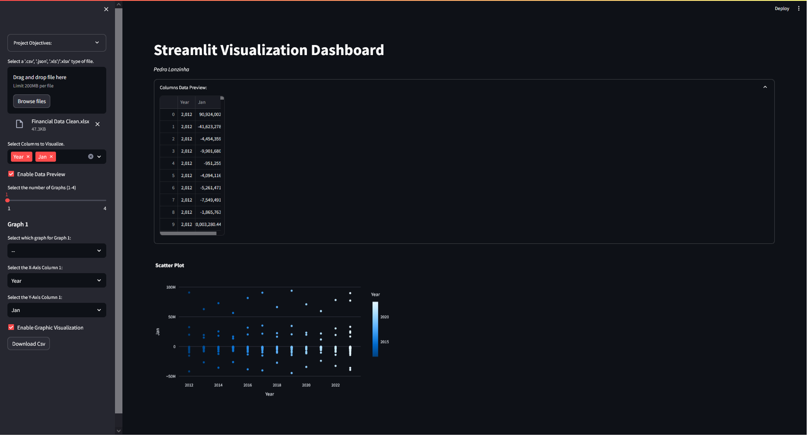

# Streamlit Visualization Dashboard

This Python Project aims to create a Dynamic Dashboard, that enables anyone to easily load a csv, json, and excel type of file to easily, combine, visualize, and download data, for example, one can combine data in a certain way, arrange orders and select only what the user wants and download it with only those columns and data in it. Apart from that, this project aims to allow the user to visualize the data being handled, not only by being able to see the data and columns on the screen, but also to visualize graphical combinations with the ability to download the graphical images separately.

### Features

    File Upload: Upload datasets in various formats (.csv, .json, .xls, or .xlsx).
    Column Selection: Select specific columns from the uploaded dataset for visualization.
    Multiple Visualization Options: Create up to 4 different visualizations with options for Bar Charts, Line Charts, and Scatter Plots.
    Data Preview: Preview the selected columns of data before visualization.
    Download Options: Download the selected data as a CSV file and the visualizations as PNG images.

